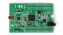
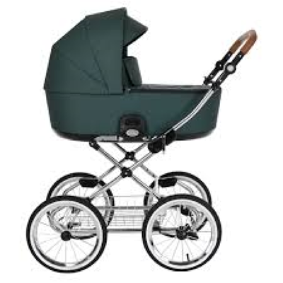

# **Documentation and notes**

|CppCheck|Misra|Doxygen|Stm32f407|CubeIde|QT Creator|C11|FreeRTOS
|:--:|:--:|:--:|:--:|:--:|:--:|:--:|:--:|
||)|||||||

## About the product

||The purpose of the product is precision control of the stroller, multiple repetition of the trajectory with the parameters set by the Consumer, imitation of lulling the baby. The product is a Collectorless Wheel Control Unit. The control unit is mounted on a baby stroller with a pair of motorless wheels and a pair of standard wheels. The wheels do not swivel.|
|--|:--|

## Product features

Product features from the Consumer's point of view:
 1. Interactive bluetooth control via smartphone application or PC Console
    - Start moving
    - Stop movement
    - Reset motion
 2. Trajectory parameters customizable by the Consumer:
    - Rolling amplitude
    - Period of one rolling iteration
    - Interactive position control:
       - Clockwise/counterclockwise rotation
       - Left and right shift
       - Skating amplitude change
       - Skating period change
       - Push the stroller forward or backward
 3. Security settings include:
    - Maximum amplitude
    - Maximum velocity
    - Wheel angle difference

Technological functionality of the product:
 1. Telemetry output to PC Console
 2. Checking the bluetooth connection
 3. Technical low-level control settings:
    - Duty cycle Period
    - Bounce time
    - Sinusoidal or trapezoidal control
 4. Technical high-level control settings:
    - Regulator coefficients
    - Telemetry output frequency
    - Controller call frequency
    - Controller setpoint type

## About the system

The system currently consists of three projects: embedded firmware, regulator project and PC console. The PC console is technological software - it does not participate in the final product for the Customer.

### Coding style

 - Projects use a style based on GNU style and FreeRTOS style. You can see an example [here](Notes/My_code_style.txt).
 - Doxygen-style documentation, generated automatically
 - Static code analysis was performed by the CppCheck analyzer
 - The mandatory and requirements of the misra 2012 standard have been complied with

Note: the console project is a technology project, so the coding style is not fully supported.

## Repository description

 1. Folder [ConsolePC](ConsolePC/) contains the generated Doxygen [documentation][PC_Console_Doc] of PC Console.
 2. Folder [ServingSoft](ServingSoft/) contains the generated Doxygen [documentation][Serving_soft_Doc] of embedded firmware.
 3. Folder [TAC](TAC/) contains the generated Doxygen [documentation][TAC_Doc] of regulator project.
 4. Folder [CppCheck_misra](CppCheck_misra/) containstatic code analysis configuration files according to misra 2012 standard.
 5. Folder [Notes](Notes/) contain product notes.
 6. Folder [Other](Other/) associated files
 7. File Protocol_Stroller_Console.doc describes [the protocol](Protocol_Stroller_Console.doc) of interaction between the stroller and the PC Console.

## Workplan
 - [x] Move and rotate the stroller
 - [x] PID regulator
 - [x] Communication data between the stroller and PC Console via bluetooth
 - [ ] Orientation and stabilization of a stroller trajectory on camera using aruco marker
    - [ ] Refactoring and documentation of existing software
    - [ ] Testing OrangePi3 features
    - [ ] SPI communication Orange<=>Stm
    - [ ] Possible synchronization via GPIO Orange<=>Stm
    - [ ] Debugging OpenCV on Windows on PC
    - [ ] Debugging OpenCV on Ubuntu on PC
    - [ ] Interaction with camera on PC
    - [ ] Processing, orientation calculation on Ubuntu PC
    - [ ] Porting camera algorithms to OrangePi3
    - [ ] Assembly of all project functionality
    - [ ] Improvement of Stm software for interaction with OrangePi3

---

## My contacts:

[PC_Console_Doc]: ./ConsolePC/html/index.html "Если не открылось, то через проводник открыть файл в браузере ConsolePC/html/index.html"
[Serving_soft_Doc]: ./ServingSoft/html/index.html "Если не открылось, то через проводник открыть файл в браузере ServingSoft/html/index.html"
[TAC_Doc]: ./TAC/html/index.html "Если не открылось, то через проводник открыть файл в браузере TAC/html/index.html"
